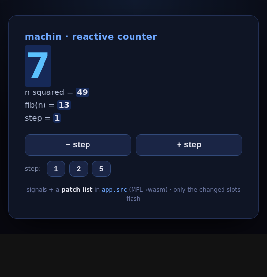

# machin-web-demo-reactive — signals + a patch list, in machin

A counter whose **state and view logic live entirely in machin**, compiled to
WebAssembly, with **fine-grained reactivity**: each piece of the view is bound to
a signal, and a click patches **only the slots that actually changed** — no
`innerHTML` replacement, no virtual-DOM diff. It's the Solid/Leptos model, here in
MFL.



*(Only the changed slots flash — `count`, `n²`, `fib` update on a bump; `step`
doesn't, because nothing it reads changed.)*

## The model

[`reactive.src`](reactive.src) (from
[machin/framework](https://github.com/javimosch/machin/tree/main/framework)) is a
~70-line runtime:

- **signals** hold state — `c := signal(0)`, `get(c)`, `set(c, v)`.
- **bindings** are compute closures tied to a DOM slot — `bind("count", func(){ return str(get(c)) })`.
  While a binding first runs, every signal it reads is **auto-tracked** as a dependency.
- on `set`, **only the bindings that read that signal** recompute, and only those
  whose rendered **text actually changed** emit a patch: `dom_patch(slot, value)`.

The whole "patch list" is just that sequence of `dom_patch` calls — the host sets
the `textContent` of the handful of changed slots. The component (`app.src`):

```go
var count = 0    // the count signal's id
var step = 0     // the step signal's id

export func start() {
    count = signal(0)
    step = signal(1)
    bind("count", func() { return str(get(count)) })
    bind("sq",    func() { return str(get(count) * get(count)) })
    bind("fib",   func() { return str(fib(get(count))) })
    bind("step",  func() { return str(get(step)) })
}
export func bump(dir)   { set(count, get(count) + dir * get(step)) }
export func set_step(s) { set(step, s) }
```

## What "fine-grained" buys you (verified)

| action | patches emitted |
|---|---|
| load | `count=0, sq=0, fib=0, step=1` |
| `+ step` (×1) | `count=1, sq=1, fib=1`  — **step untouched** |
| `+ step` again | `count=2, sq=4`  — **`fib` not patched** (`fib(2)=fib(1)=1`, text unchanged) |
| `step: 5` | `step=5`  — **only step** |
| `+ step` | `count=7, sq=49, fib=13` |

Two signals, independent dependency graphs; a change touches the minimum.

## How it's wired

machin builds on:
- **`[]func`** (slices of functions, machin v0.53.0) — the binding registry is a
  `[]func` of compute closures.
- **package globals** (v0.52.0) — the signal store (`[]int`) and binding tables.
- the **`--target wasm`** bridge (v0.50.0) — `export func`s the host calls; an
  `extern "env" { fn dom_patch(string, string) }` the host supplies.

The JS host is a few lines: decode the slot/value strings from wasm memory and set
the matching `[data-s="…"]` element's text. (It also includes a tiny **no-op WASI
shim** — indirect closure calls keep wasi-libc's float-format symbols in the
binary; they're imported but never called.)

## Build & run

Needs `machin` (**v0.53.0+**) and [`zig`](https://ziglang.org).

```sh
./build.sh                       # → app.wasm
python3 -m http.server 8000      # serve over http (not file://)
# open http://localhost:8000/
```

## What's next

This is the reactive core. Beyond it: derived/computed signals as first-class
bindings, list reconciliation (keyed children), and reusing the server-rendered
DOM on hydration. See the
[web north star](https://github.com/javimosch/machin/blob/main/docs/NORTH-STAR-WEB.md).

## License

MIT
